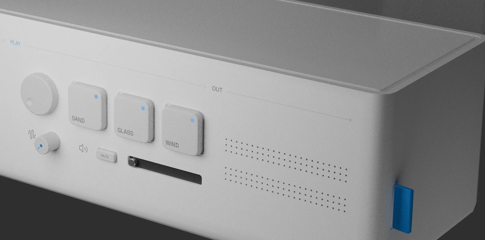

## Tone Marble
> TM-07: An unrealistic instrument

[Try it out](https://nenw.dev/tone-marble/docs/)

### Description
This is a final project for my course `CTP.40031`: Fundamentals of Computer Music.  
This project aims to create the TM-07, an unrealistic instrument, which synthesizes sound when a marble collides with a pillar, in a virtual space.

So, why don't you experience it firsthand?
